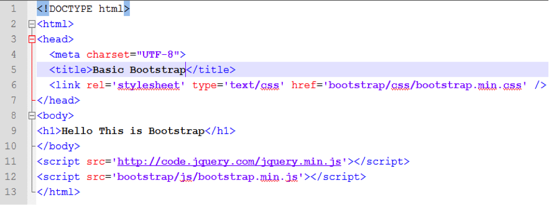

# Challenge: Creating Your First Web Page with Bootstrap

Let's walk through our very first page design, using Bootstrap. At the end of this tutorial, you will have made a HTML file that displays the "Hello world" message in your web browser.

1. Open up Sublime (code text editor we have previously downloaded).
2. Begin by entering the following code and save it as "boot.html".

The only notable difference from the above example that you may see is in the styling of the text. In the above code, you have added the bootstrap CSS in the header (bootstrap/css/bootstrap.min.css) and two scripts at the end of the body tag. Now, you are ready to use bootstrap, and this is just the beginning!

